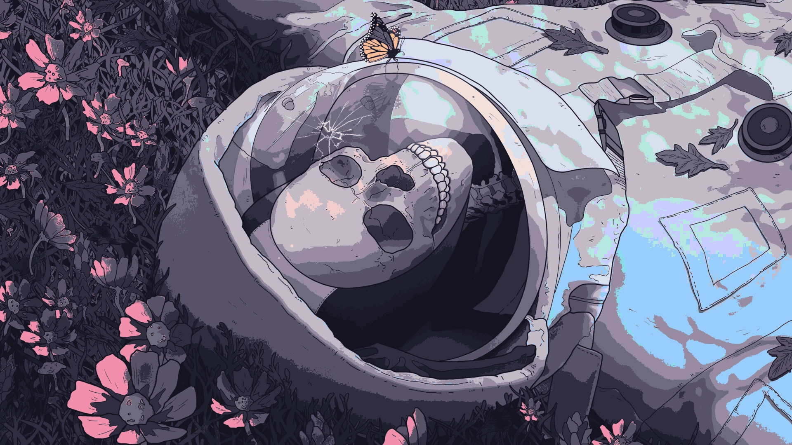
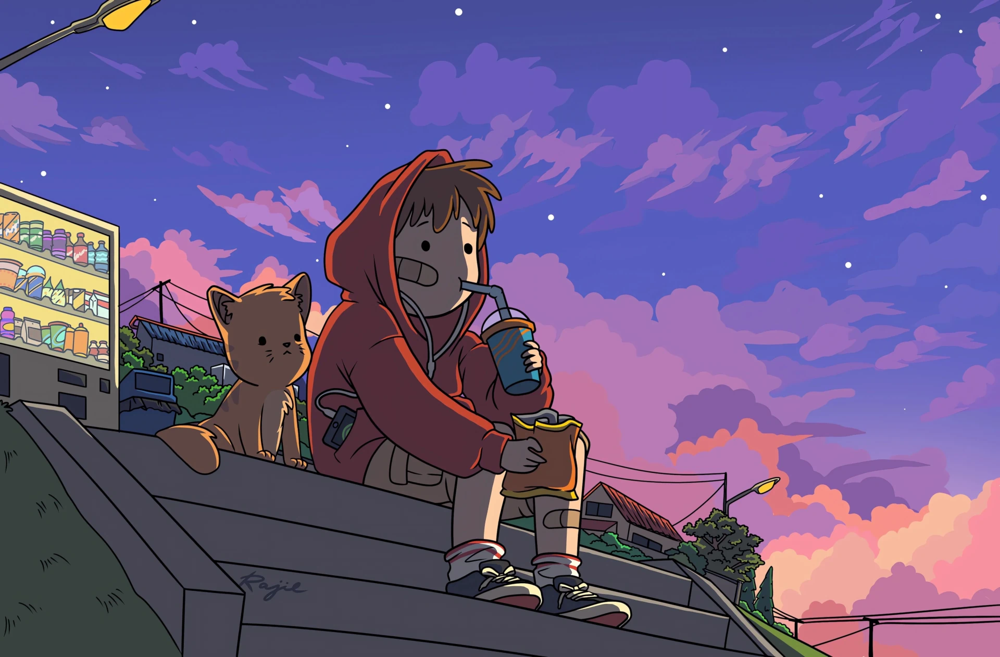
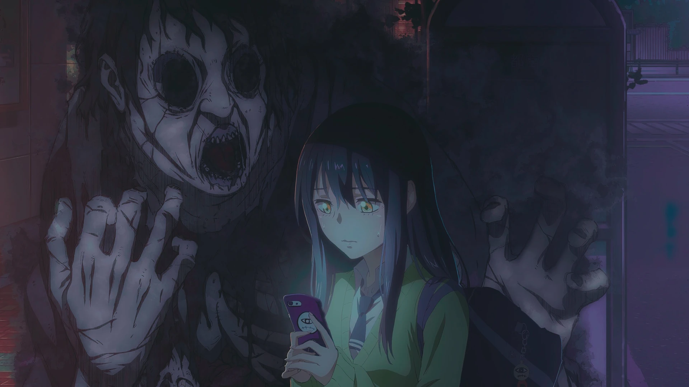
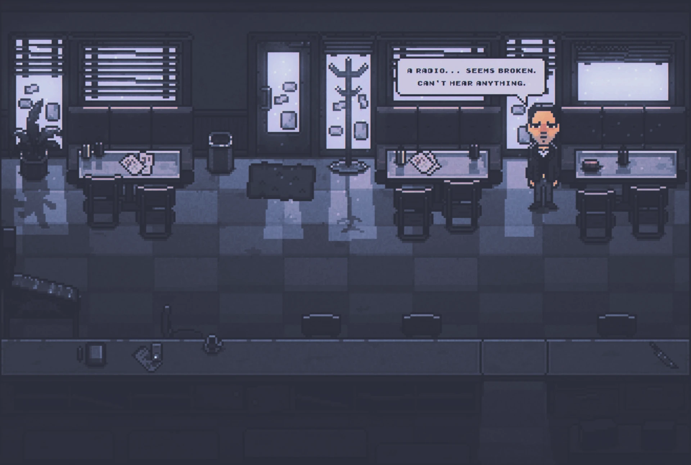
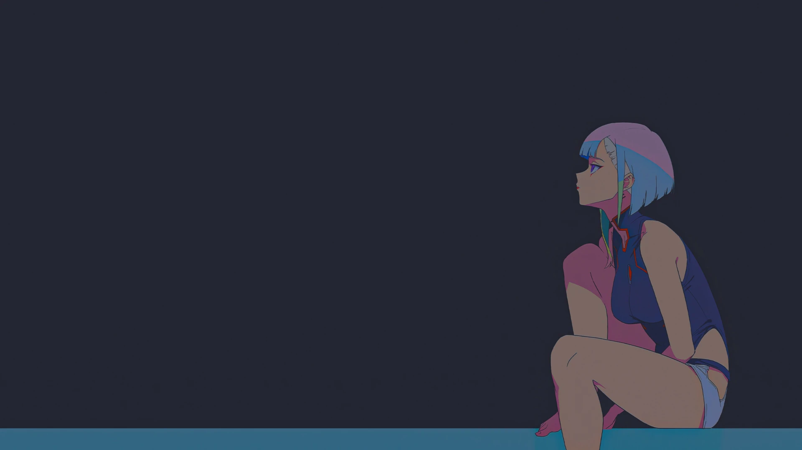

# BSPWM Temas | Entorno completo con bspwm

<div align = center>
   


&ensp;[<kbd> <br> Instalacion <br> </kbd>](#-el-setup)&ensp;
&ensp;[<kbd> <br> Caracteristicas <br> </kbd>](#-caracteristicas)&ensp;
&ensp;[<kbd> <br> Temas <br> </kbd>](#-los-temas)&ensp;
&ensp;[<kbd> <br> Atajos de teclado <br> </kbd>](#atajos-de-teclado-utiles-que-deberias-saber)&ensp;
&ensp;[<kbd> <br> Wiki <br> </kbd>](https://github.com/gh0stzk/dotfiles/wiki)&ensp;
<br><br><br></div>

https://user-images.githubusercontent.com/67278339/211363959-9182ecb7-e56e-4598-afed-f352c5d2979e.mp4
 
<br>

## 🚀 Caracteristicas


**Experimenta la Magia de la Personalización con los dotfiles de gh0stzk para bspwm**

<sup>¡Bienvenido al mundo de la personalización sin límites! Los dotfiles de gh0stzk para bspwm ofrecen una experiencia única y emocionante con 15 temas distintos, cada uno con esquemas de colores, estilo y personalidad cautivadora. Sumérgete en un viaje visual que transformará tu entorno de trabajo de una manera impresionante.</sup>

**Cambia de temas al instante**

<sup>Con el menú personalizado basado en rofi launcher, cambiar entre los 15 temas es tan fácil como un clic. Disfruta de la versatilidad de estilos y esquemas de colores al momento.</sup>

**Coherencia en Todo el Sistema**

<sup>Cada tema no solo cambia la apariencia de bspwm, sino que también transforma al instante el esquema de colores en la terminal alacritty, widgets eww, barras polybar, notificaciones y más. La armonía visual está garantizada en todos los rincones de tu sistema.</sup>

**Widgets Eww Únicos**

<sup>Descubre 4 widgets eww únicos, que incluyen un calendario, menú de apagado, reproductor de música y tarjeta de usuario. Estos widgets no solo son funcionales, sino que también se adaptan instantáneamente al esquema de colores del tema que elijas.</sup>

**Personalización Completa**

<sup>Menú de clic derecho elegante hecho con Jgmenu, que también se sincroniza con los temas para una coherencia visual impecable. Además, 10 barras hechas con polybar y 2 con widgets eww ofrecen una experiencia de usuario completamente personalizable.</sup>

**Variedad de Fondos de Pantalla**

<sup>Cada inicio de sesión te sorprenderá con un fondo de pantalla al azar seleccionado específicamente para el tema en uso. Pero si la sorpresa no es lo tuyo, nuestro menú de fondos de pantalla te permite elegir entre más de 5 fondos de pantalla exclusivos para cada tema.</sup>

**Composición Visual con Picom**

<sup>Experimenta la belleza sin esfuerzo con picom como compositor, proporcionando una estética agradable sin sacrificar rendimiento. Disfruta de una experiencia de trabajo sin complicaciones con efectos visuales agradables. Una configuracion balanceada entre rendimiento y estética.
Ajusta la transparencia de tus ventanas abiertas con una simple combinación de teclas. Controla la apariencia de tu escritorio para que se adapte perfectamente a tu estado de ánimo y estilo.</sup>

**Funcionalidades Adicionales:**

- **Control de Música Local:**

  <sup>Administra tu música local desde el módulo polybar y el reproductor ncmpcpp, ambos con un diseño único que se ajusta al esquema de colores del tema.</sup>
- **Flexibilidad:**

  <sup>Esconde y muestra la barra polybar y los widgets eww según tus necesidades, brindándote un control completo sobre tu espacio de trabajo.</sup>

- **Scratchpad Funcional:**
  
  <sup>Accede a la funcionalidad scratchpad, una ventana de terminal que puedes mostrar o esconder según tus tareas, evitando que ocupe espacio innecesario en tu escritorio.</sup>

¡Transforma tu experiencia de usuario con los dotfiles de gh0stzk para bspwm! Descarga ahora y da vida a tu escritorio con estilo y personalidad.

## :book: Wiki
Ya comencé a escribir la [**Wiki**](https://github.com/gh0stzk/dotfiles/wiki), deberías darle una lectura. Si es tu primera vez con un WM tal vez te interese leer [Primeros pasos despues de instalar los dotfiles](https://github.com/gh0stzk/dotfiles/wiki/Firsts-steps-after-installing) ó tal vez leer las [pregumtas y respuestas](https://github.com/gh0stzk/dotfiles/wiki/Questions---Answers) [Atajos de teclado](https://github.com/gh0stzk/dotfiles/wiki/Keyboard-Shortcuts)[Tema Firefox](https://github.com/gh0stzk/dotfiles/wiki/Firefox-Theme).

<br>

> [!CAUTION]
> ⚠️⚠️⚠️ Esta configuración fue hecha en una resolución **1600x900** con **96** DPI y **1** monitor.
> Algunas cosas prodrian romperse en una resolucion menor o mayor, pero igual funcionara!! ⚠️⚠️⚠️

<br>

## 🎨 Los Temas

| :tshirt: Menu de Temas |
|:-:|
||

| :traffic_light: Menu Wallpapers |
|:-:|
||


### 🌸Emilia:

||
|---|

<details>
<summary><b>Extra wallpapers en Emilia</b></summary>

||||
|:-:|:-:|:-:|
||||

</details>

### 🌸Jan

||
|---|

<details>
<summary><b>Extra wallpapers en Jan</b></summary>

||||
|:-:|:-:|:-:|
||||

</details>

### 🌸Aline

||
|---|

<details>
<summary><b>Extra wallpapers en Aline</b></summary>

||||
|:-:|:-:|:-:|
||||

</details>

### 🌸Andrea

||
|---|

<details>
<summary><b>Extra wallpapers en Andrea</b></summary>

|||
|:-:|:-:|:-:|
||

</details>

### 🌸Cynthia

||
|---|

<details>
<summary><b>Extra wallpapers en Cynthia</b></summary>

||||
|:-:|:-:|:-:|
|||

</details>

### 🌸Isabel

||
|---|

<details>
<summary><b>Extra wallpapers en Isabel</b></summary>

||||
|:-:|:-:|:-:|
|||

</details>

### 🌸Silvia

||
|---|

<details>
<summary><b>Extra wallpapers en Silvia</b></summary>

||||
|:-:|:-:|:-:|
|||

</details>

### 🌸Melissa

||
|---|

<details>
<summary><b>Extra wallpapers en Melissa</b></summary>

||||
|:-:|:-:|:-:|
|||

</details>

### 🌸Pamela

||
|---|

<details>
<summary><b>Extra wallpapers en Pamela</b></summary>

||||
|:-:|:-:|:-:|
||||

</details>

### 🌸Cristina

||
|---|

<details>
<summary><b>Extra wallpapers en Cristina</b></summary>

||||
|:-:|:-:|:-:|
|||

</details>

### 🌸Karla
**(Zombie-Night Color Scheme)**
||
|---|

<details>
<summary><b>Extra wallpapers en Karla</b></summary>

||||
|:-:|:-:|:-:|
|||
|

</details>

### 🌸z0mbi3:

||
|---|

<details>
<summary><b>Extra wallpapers en z0mbi3</b></summary>

||||
|:-:|:-:|:-:|
|||

</details>

### 🌸Brenda:

||
|---|

<details>
<summary><b>Extra wallpapers en Brenda</b></summary>

||||
|:-:|:-:|:-:|
|||

</details>

### 🌸Daniela:

||
|---|

<details>
<summary><b>Extra wallpapers en Daniela</b></summary>

||||
|:-:|:-:|:-:|
|||

</details>

### 🌸Marisol:

||
|---|

<details>
<summary><b>Extra wallpapers en Marisol</b></summary>

||||
|:-:|:-:|:-:|
|||

</details>

## Firefox Theme (z0mbi3 Fox)

||
|:-:|
Tambien puedes instalar [esta extension](https://github.com/PonyLucky/gh0stzk-Firefox/tree/master/extension) hecha por [PonyLucky](https://github.com/PonyLucky). Es una pagina de inicioi. [Preview y opciones de configuracion](https://github.com/PonyLucky/gh0stzk-Firefox/tree/master/extension). Se ve genial con mi tema de firefox.

## Neovim Setup

||
|:-:|
Plugins incluidos [Neovim setup wiki](https://github.com/gh0stzk/dotfiles/wiki/Neovim-setup)

## Atajos de teclado utiles que deberias saber...

| Keys | Action |
|:-|:-|
|<kbd>super</kbd> + <kbd>Enter</kbd><br><kbd>super</kbd> + <kbd>alt</kbd> + <kbd>Enter</kbd>| Abre una terminal<br>Abre una terminal flotante
|<kbd>alt</kbd> + <kbd>@space</kbd>| Abre el menu para seleccionar un nuevo tema
|<kbd>super</kbd> + <kbd>@space</kbd>| Menu de apps
|<kbd>super</kbd> + <kbd>alt</kbd> + <kbd>w</kbd>| Menu para seleccionar un wallpaper
|<kbd>super</kbd> + <kbd>h</kbd><br><kbd>super</kbd> + <kbd>u</kbd>|Esconde la barra/s<br>Muestra nuevamente la barra/s
|<kbd>Print</kbd>| Toma captura de pantalla
|<kbd>ctrl</kbd> + <kbd>alt</kbd> + <kbd>[plus,minus,t]</kbd>| Changes transparency on focused window
|<kbd>ctrl</kbd> + <kbd>super</kbd> + <kbd>alt</kbd> + <kbd>p</kbd><br><kbd>ctrl</kbd> + <kbd>super</kbd> + <kbd>alt</kbd> + <kbd>r</kbd><br><kbd>ctrl</kbd> + <kbd>super</kbd> + <kbd>alt</kbd> + <kbd>k| Apaga la computadora<br>Reinicia la computadora<br>Mata un proceso o ventana
|<kbd>super</kbd> + <kbd>alt</kbd> + <kbd>r</kbd>| Reinicia bspwm

Y mas... Necesitaras mirar el archivo sxhkdrc file para ver todos los atajos.

## 📦 El Setup

### 💾 Instalacion:
El instalador solo funciona con **ARCH** Linux, y derivadas.

<b>Abre una terminal en tu HOME</b>
- **Primero descarga el instalador**
```sh
curl https://raw.githubusercontent.com/gh0stzk/dotfiles/master/RiceInstaller -o $HOME/RiceInstaller

# Tal vez quieres una url mas corta??

curl -L https://is.gd/gh0stzk_dotfiles -o $HOME/RiceInstaller
```
- **Ahora dale permisos de ejecucion**
```sh
chmod +x RiceInstaller
```
- **Finalmente ejecuta el instalador**
```sh
./RiceInstaller
```
