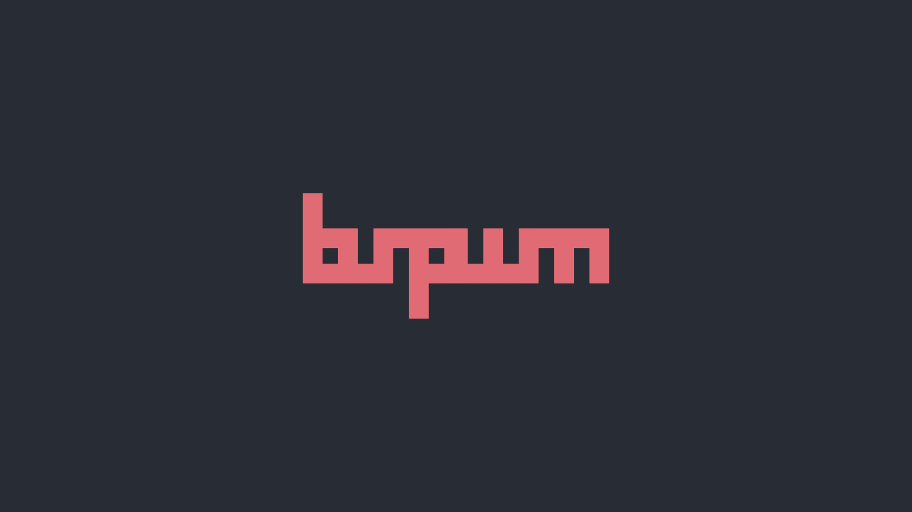
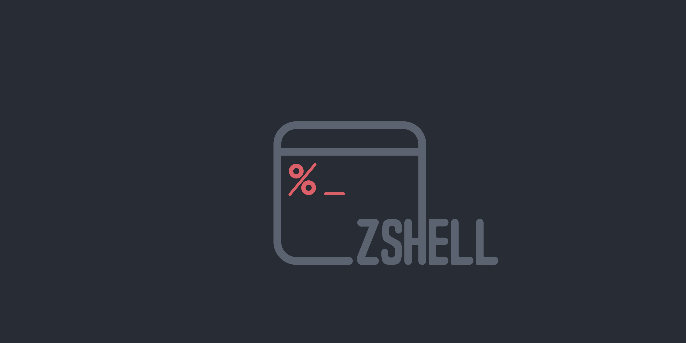
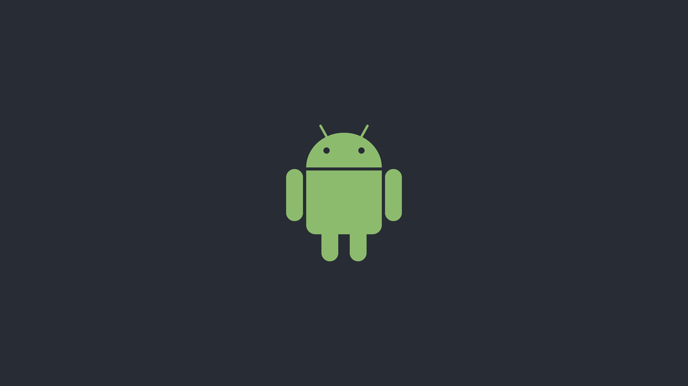

# BSPWM | Polybar | Coleccion de temas

## 🌿 Informacion
Mi versión del tema bspwm de gh0stzk

## :book: Wiki
Ya comencé a escribir la [**Wiki**](https://github.com/gh0stzk/dotfiles/wiki), deberías darle una lectura. Si es tu primera vez con un WM tal vez te interese leer [Primeros pasos despues de instalar los dotfiles](https://github.com/gh0stzk/dotfiles/wiki/Firsts-steps-after-installing) ó tal vez leer las [pregumtas y respuestas](https://github.com/gh0stzk/dotfiles/wiki/Questions---Answers).
 
## Información


|Distro|[Arch](https://archlinux.org/)|
|:---:|:---:|
|WM|[BSPWM](https://github.com/baskerville/bspwm)|
|Bar|[Polybar](https://github.com/polybar/polybar)|
|Menu|[Rofi](https://github.com/davatorium/rofi)|
|Compositor|[Picom](https://archlinux.org/packages/community/x86_64/picom/)|
|Terminal|[Alacritty](https://github.com/alacritty/alacritty)|
|Widgets|[ElKowars wacky widgets ](https://github.com/elkowar/eww)|
|Music/Player|[mpd](https://archlinux.org/packages/extra/x86_64/mpd/)-[ncmpcpp](https://archlinux.org/packages/community/x86_64/ncmpcpp/)|
|File Manager|[Ranger](https://github.com/ranger/ranger)|
|Shell|[Zsh](https://archlinux.org/packages/extra/x86_64/zsh/)|
|Aur Helper|[Yay](https://github.com/Jguer/yay)|

<br>

## 🚀 Caracteristicas
* **Wallpapers al azar:**  Cada vez que cambias de tema o reinicias bspwm <code>super + alt + r</code> tendras un wallpaper diferente dependiendo el tema en el que estes.

* **Super + Alt + w** Cambia entre los diferentes wallpapers que tiene el tema.

* **Mostrar / Ocultar barra:** Podras ocultar y volver a mostrar la barra ( Polybar y EWW )

* **Cambia la transparencia:** 
Aumenta o disminuye la transparencia de la ventana de trabajo en la que estes.

**Y mas..**

<table align="center">
   <tr>
      <th align="center">
         <sup><sub>:warning: Cuidado!! :warning:</sub></sup>
      </th>
   </tr>
   <tr>
      <td align="center">
      
      
      
     MIS CONFIGURACIONES LAS HICE CON UNA RESOLUCION 1600x900 CON 96 DPI! 1 MONITOR
     ALGUNAS COSAS TAL VEZ SE ROMPAN CON RESOLUCIONES DIFERENTES
     PERO IGUAL FUNCIONARA!
     
   </tr>
   </table>

## 🎨 El tema

|||
|---|---|

<details>
<summary><b>Extra wallpapers</b></summary>

||||
|:-:|:-:|:-:|
|||

</details>

## Temas NEOVIM
Actualmente el tema de neovim es OneDark, pero el fondo se adaptara a los colores del tema en el que estes. Esta configurado en Lua, con pocos plugins para mantenerlo simple, pero siempre puedes agregar los tuyos.
- Lualine
- Nvim-Tree
- Colorizer
- Devicons

El manejador de plugins es Packer.


## Firefox Theme (z0mbi3 Fox)

||
|:-:|
Tambien puedes instalar [esta extension](https://github.com/PonyLucky/gh0stzk-Firefox/tree/master/extension) hecha por [PonyLucky](https://github.com/PonyLucky). Es una pagina de inicioi. [Preview y opciones de configuracion](https://github.com/PonyLucky/gh0stzk-Firefox/tree/master/extension). Se ve genial con mi tema de firefox.

## Atajos de teclado utiles que deberias saber...

- <code>super + F1</code> Menu de apps.
- <code>super + h </code> Esconde la barra <code>super + u</code> Muestra nuevamente la barra.
- <code>super + Print</code> Toma captura de pantalla.
- <code>ctrl + alt + plus</code> Incrementa la transparencia de la ventana. <code>ctrl + alt + minus</code> Decrementa la transparencia. <code>ctrl + alt + t</code> Reestablece la transparencia por default.
- <code>ctrl + super + alt + p</code> Apaga la computadora. <code>ctrl + super + alt + r</code> Reinicia la computadora.
- <code>super + Return</code> Abre una terminal.
- <code>super + Alt + Return</code> Abre una terminal flotante.
- <code>ctrl + super + alt + k</code> Mata un proceso o ventana.
- <code>super + alt + w</code> Cambia al azar el wallpaper.
- <code>super + alt + r</code> Reinicia bspwm.

Y mas... Necesitaras mirar el archivo sxhkdrc file para ver todos los atajos.

## 📦 El Setup

### 💾 Instalacion:
El instalador solo funciona con **ARCH** Linux, y derivadas.

<b>Abre una terminal en tu HOME</b>
- **Primero descarga el instalador**
```sh
curl https://raw.githubusercontent.com/edwark43/dotfiles/master/RiceInstaller -o $HOME/RiceInstaller
```
- **Ahora dale permisos de ejecucion**
```sh
chmod +x RiceInstaller
```
- **Finalmente ejecuta el instalador**
```sh
./RiceInstaller
```

## Problemas y Tips

Mira la [Wiki](https://github.com/gh0stzk/dotfiles/wiki)

## Creditos

- [turquoise-hexagon](https://github.com/turquoise-hexagon/fonts), [adi1090x](https://github.com/adi1090x/widgets), [gabrielzschmitz](https://github.com/gabrielzschmitz), [elenapan](https://github.com/elenapan/dotfiles), [rxyhn](https://github.com/rxyhn/bspdots), [okklol](https://github.com/okklol/eww-bar), [ikz87](https://github.com/ikz87), [Narmis-E](https://github.com/Narmis-E/onedark-wallpapers), [gh0stzk](https://github.com/gh0stzk/dotfiles).
