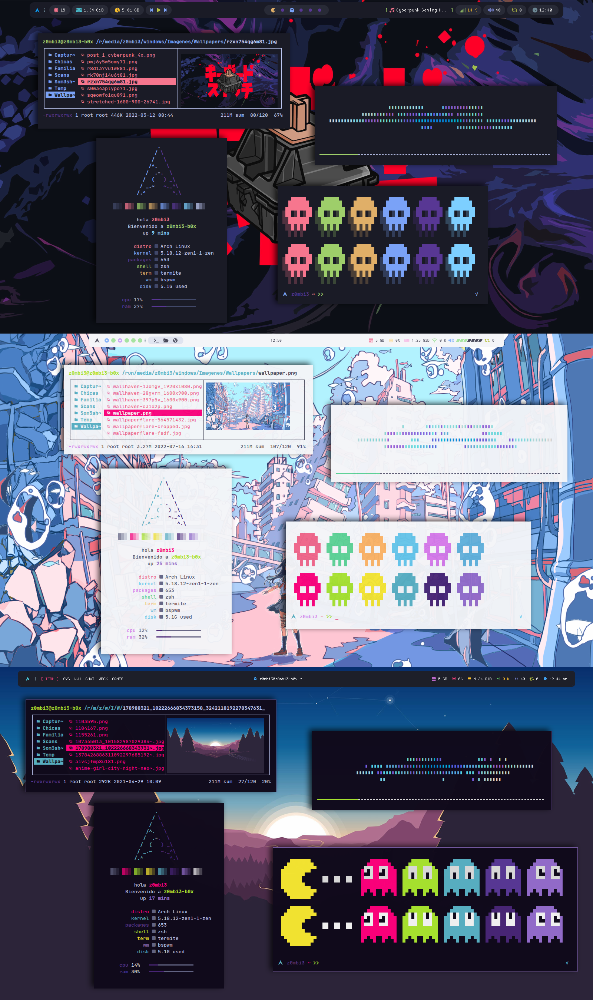

# Triple Rice - Rice selector

## 🌿 Information
Hello, I started learning bash and decided to modify and create some scripts to practice and as a fan to rice my setup i made these modifications to switch between rices, live at the moment without having to quit the session. It's not perfect and there's certainly room for improvement. To switch between setups right-click on the arch logo in the bar.

https://user-images.githubusercontent.com/67278339/179444283-d5a4bc48-a9c7-4a91-a144-6c34d11347c8.mp4

 
 
|Distro|WM|Bar|Compositor|Terminal|
|------|------|------|------|------|
|[Arch](https://archlinux.org/)|[BSPWM](https://github.com/baskerville/bspwm)|[Polybar](https://github.com/polybar/polybar)|[Picom](https://github.com/Arian8j2/picom)|[Termite](https://aur.archlinux.org/termite.git)|

## ⚠️ Attention!!
The settings are heavily edited to work on my machine in my 1600x900 resolution. You will probably have to change many things like the terminal "termite" in the files and change it to your own.

## 📦 setup

### Installation:
I will only provide instructions for arch based distributions.

<b>1. Install Dependencies: </b></summary> 

A one time command to install most of these dependencies with your favorite AUR Helper.

```sh
paru -S bspwm polybar sxhkd dunst rofi lsd mpd ncmpcpp mpc picom-arian8j2-git xtitle termite checkupdates-aur nerd-fonts-jetbrains-mono ttf-inconsolata 
```

<b
>2. Installing Dotfiles:</b></summary>
The step we all have been waiting for.
