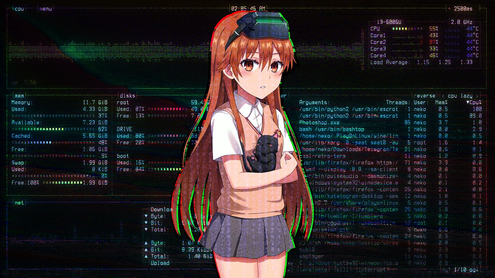
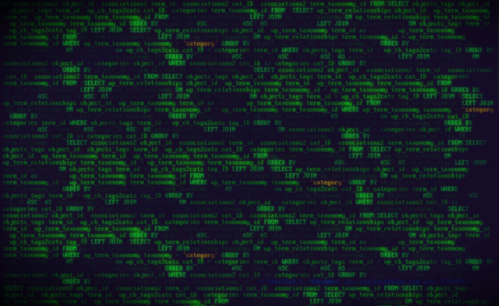
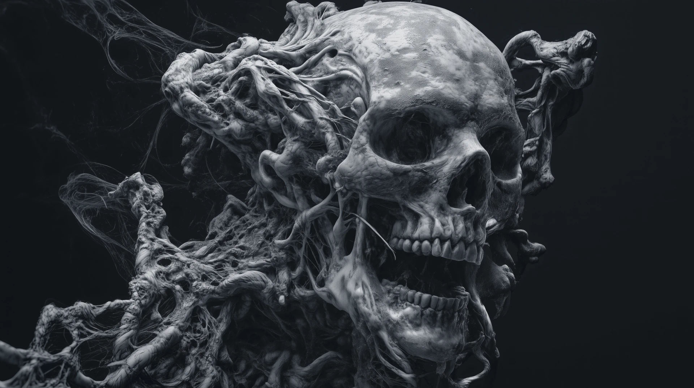
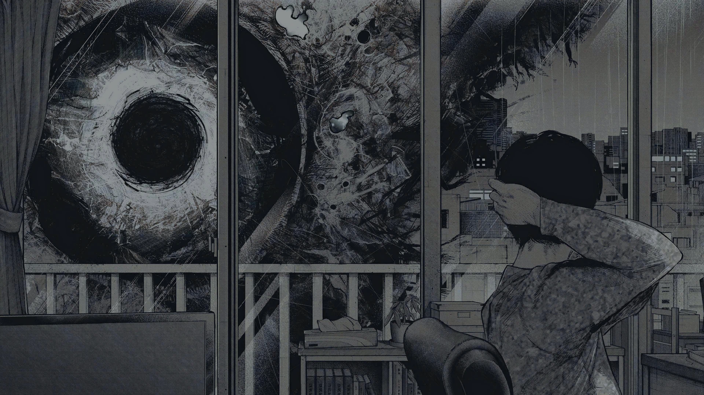
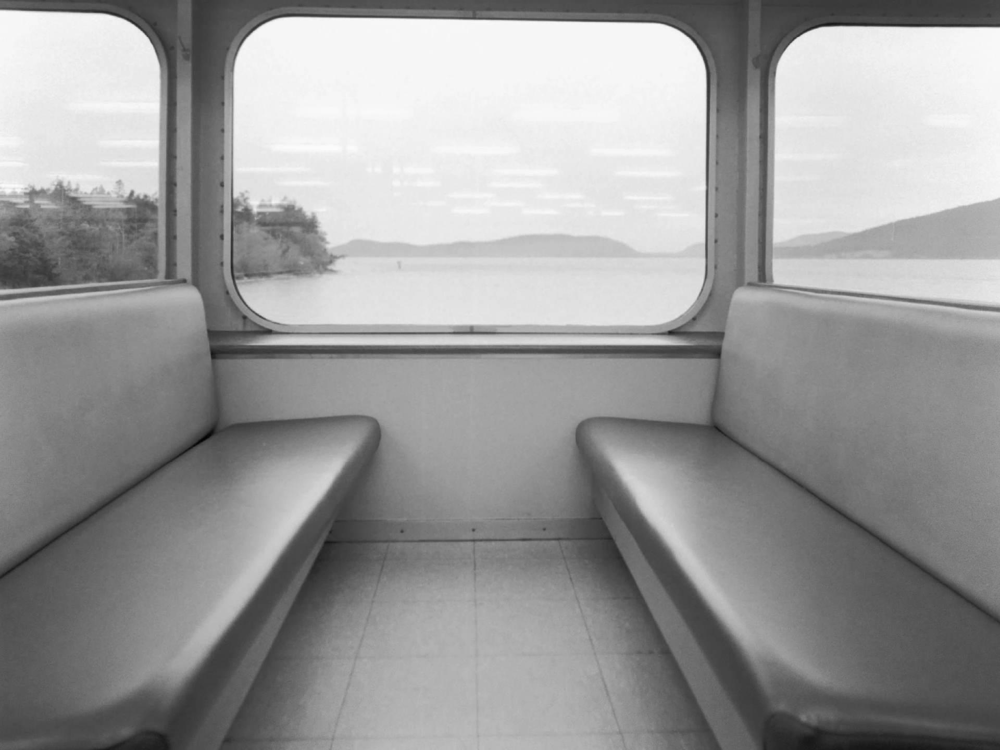
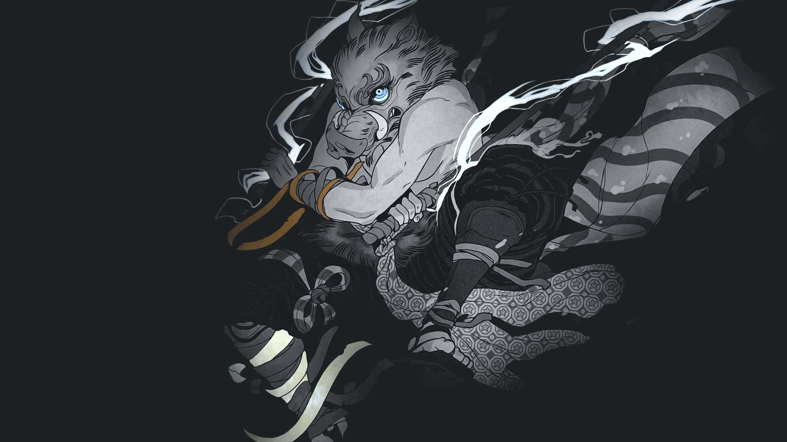
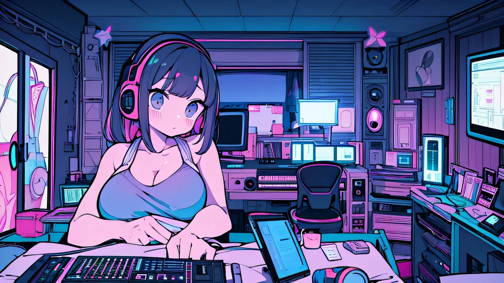

# A complete BSPWM Window Manager Environment
<div align = center>
   


&ensp;[<kbd> <br> Install <br> </kbd>](#-setup)&ensp;
&ensp;[<kbd> <br> Features <br> </kbd>](#-features)&ensp;
&ensp;[<kbd> <br> Themes <br> </kbd>](#-the-themes)&ensp;
&ensp;[<kbd> <br> Keybindings <br> </kbd>](#very-useful-keybindigs-to-know)&ensp;
&ensp;[<kbd> <br> Wiki <br> </kbd>](https://github.com/gh0stzk/dotfiles/wiki)&ensp;
&ensp;[<kbd> <br> En Español <br> </kbd>](INICIO.md)&ensp;
<br><br><br></div>

https://user-images.githubusercontent.com/67278339/211363959-9182ecb7-e56e-4598-afed-f352c5d2979e.mp4

<br>

## 🚀 Features


**Experience the Magic of Customization with gh0stzk's bspwm dotfiles**

<sup>Welcome to the world of limitless customization! gh0stzk's dotfiles for bspwm offer a unique and exciting experience with 18 different themes, each featuring captivating color schemes, styles and personality. Immerse yourself in a visual journey that will transform your workspace in an impressive way.</sup>

**Change themes on the fly**

<sup>With our custom menu based on rofi launcher, switching between the 18 themes is as easy as a click. Enjoy the versatility of styles and color combinations instantly.</sup>

**Consistency Across the Environment**

<sup>Each theme not only changes the appearance of bspwm but also instantly transforms the color scheme in alacritty terminal, eww widgets, polybar bars, notifications, and more. Visual harmony is guaranteed in every corner of your system.</sup>

**Eww Widgets**

<sup>Discover eww widgets, including a calendar, music player, and user card. These widgets are not only functional but also instantly adapt to the color scheme of the selected theme.</sup>

**Complete Customization**

<sup>Explore an elegant right-click menu made with Jgmenu, which also syncs with themes for flawless visual consistency. Additionally, 16 polybar bars and 2 eww widgets offer a fully customizable user experience.</sup>

**Variety of Wallpapers**

<sup>Each login surprises you with a randomly selected wallpaper specifically tailored to the theme in use. But if surprises aren't your thing, our wallpaper menu lets you choose from over 5 exclusive wallpapers for each theme.</sup>

**Visual Composition with Picom**

<sup>Experience effortless beauty with picom as the compositor, providing a pleasing aesthetic without sacrificing performance. Enjoy a hassle-free working experience with delightful visual effects, balance between performance and beauty..
And you can adjust the transparency of your open windows with a simple key combination. Control the appearance of your desktop to perfectly suit your mood and style.</sup>

**Enhanced Rofi Applets**

<sup>Take control of your network connections effortlessly with our new rofi applet for **NetworkManager**. Manage your Bluetooth devices with ease using the **Bluetooth control applet**. Take control of your clipboard with the new **Clipboard manager** applet, never lose something you copied again. Capture screenshots seamlessly with the dedicated **screenshot applet**. Manage your android phones via USB with the new **MTP Android applet**. Plus, enjoy a new **power menu applet**, offering options to shutdown, reboot, logout, suspend, or restart bspwm.</sup>

<details>
<summary><b>NetworkManager Applet</b></summary>
   
||
|:--:|
</details>

<details>
<summary><b>Bluetooth Applet</b></summary>

||
|:--:|
</details>

<details>
<summary><b>Android Mount Applet</b></summary>

||
|:--:|
</details>

<details>
<summary><b>Clipboard Manager Applet</b></summary>

||
|:--:|
</details>

<details>
<summary><b>Screenshoter Applet</b></summary>

||
|:--:|
</details>

<details>
<summary><b>PowerMenu Applet</b></summary>

||
|:--:|
</details>


**Terminal Selection Menu**

<sup>Choose your preferred terminal emulator between alacritty and kitty through a simple menu. The selected terminal will be the default for your environment, with alacritty set as the default.</sup>

**Tmux Configuration**

<sup>Benefit from a newly added tmux configuration and design, enhancing your terminal multiplexing experience.</sup>

**Complete Neovim Setup**

<sup>Immerse yourself in a fully configured Neovim setup with plugins, written in Lua, providing a simple but powerful and efficient code editing environment.</sup>

**Optimized ZSH Configuration**

<sup>Enjoy a complete and optimized configuration of ZSH with features such as autocompletion, syntax highlighting, history substring search, and a simple yet powerful and beautiful prompt. Elevate your command line experience to a new level of efficiency and aesthetics.</sup>

**Additional Features:**

- **Local Music Control:**
  
  <sup>Manage your local music from the polybar module and the ncmpcpp player, both with a unique design that adapts to the theme's color scheme.</sup>
- **Flexibility:**

  <sup>Hide and show the polybar and eww widgets according to your needs, giving you complete control over your workspace.</sup>
- **Functional Scratchpad:**

  <sup>Access the scratchpad functionality, a terminal window you can show or hide for tasks when you don't want the window taking up unnecessary space.</sup>

Transform your user experience with gh0stzk's dotfiles for bspwm! Install now and breathe life into your desktop with style and personality.

## :book: Wiki
I already started writing the [**Wiki**](https://github.com/gh0stzk/dotfiles/wiki), you should give it a read. If it is your first time with a WM, you may be interested in reading [First steps after installing the dotfiles](https://github.com/gh0stzk/dotfiles/wiki/Firsts-steps-after-installing) or maybe read [frequently asked questions and answers](https://github.com/gh0stzk/dotfiles/wiki/Questions---Answers) [Keybinds](https://github.com/gh0stzk/dotfiles/wiki/Keyboard-Shortcuts) [Firefox Theme](https://github.com/gh0stzk/dotfiles/wiki/Firefox-Theme).

<br>

> [!CAUTION]
> ⚠️⚠️⚠️ This dotfiles are configured at **1600x900** resolution with **96** DPI and **1** monitor.
> Some stuff might break on lower or higher resolutions, but still work!! ⚠️⚠️⚠️

<br>


## 🎨 The themes

| :tshirt: Theme Selector |
|:-:|
||

| :traffic_light: Wallpaper Selector |
|:-:|
||

### 🌸Emilia:

||
|---|

<details>
<summary><b>Extra wallpapers in Emilia</b></summary>

||||
|:-:|:-:|:-:|
||||

</details>

### 🌸Jan

||
|---|

<details>
<summary><b>Extra wallpapers in Jan</b></summary>

||||
|:-:|:-:|:-:|
||||

</details>

### 🌸Aline

||
|---|

<details>
<summary><b>Extra wallpapers in Aline</b></summary>

||||
|:-:|:-:|:-:|
||||

</details>

### 🌸Andrea

||
|---|

<details>
<summary><b>Extra wallpapers in Andrea</b></summary>

|||
|:-:|:-:|:-:|
||||

</details>

### 🌸Cynthia

||
|---|

<details>
<summary><b>Extra wallpapers in Cynthia</b></summary>

||||
|:-:|:-:|:-:|
|||

</details>

### 🌸Isabel

||
|---|

<details>
<summary><b>Extra wallpapers in Isabel</b></summary>

||||
|:-:|:-:|:-:|
|||

</details>

### 🌸Silvia

||
|---|

<details>
<summary><b>Extra wallpapers in Silvia</b></summary>

||||
|:-:|:-:|:-:|
|||

</details>

### 🌸Melissa

||
|---|

<details>
<summary><b>Extra wallpapers in Melissa</b></summary>

||||
|:-:|:-:|:-:|
|||

</details>

### 🌸Pamela

||
|---|

<details>
<summary><b>Extra wallpapers in Pamela</b></summary>

||||
|:-:|:-:|:-:|
||||

</details>

### 🌸Cristina

||
|---|

<details>
<summary><b>Extra wallpapers in Cristina</b></summary>

||||
|:-:|:-:|:-:|
|||

</details>

### 🌸Karla
**(Zombie-Night Color Scheme)**
||
|---|

<details>
<summary><b>Extra wallpapers in Karla</b></summary>

||||
|:-:|:-:|:-:|
|||

</details>

### 🌸z0mbi3:

||
|---|

<details>
<summary><b>Extra wallpapers in z0mbi3</b></summary>

||||
|:-:|:-:|:-:|
|||

</details>

### 🌸Brenda:

||
|---|

<details>
<summary><b>Extra wallpapers in Brenda</b></summary>

||||
|:-:|:-:|:-:|
|||

</details>

### 🌸Daniela:

||
|---|

<details>
<summary><b>Extra wallpapers in Daniela</b></summary>

||||
|:-:|:-:|:-:|
|||

</details>

### 🌸Marisol:

||
|---|

<details>
<summary><b>Extra wallpapers in Marisol</b></summary>

||||
|:-:|:-:|:-:|
|||

</details>

### 🌸h4ck3r:

||
|---|

<details>
<summary><b>Extra wallpapers in h4ck3r</b></summary>

||||
|:-:|:-:|:-:|
|||
|

</details>

### 🌸Varinka:

||
|---|

<details>
<summary><b>Extra wallpapers in Varinka</b></summary>

||||
|:-:|:-:|:-:|
|||

</details>

### 🌸Yael:

||
|---|

<details>
<summary><b>Extra wallpapers in Yael</b></summary>

||||
|:-:|:-:|:-:|
|||

</details>

## Firefox Theme (z0mbi3 Fox)

||
|:-:|
Complementarily you can install [this extension](https://github.com/PonyLucky/gh0stzk-Firefox/tree/master/extension) made by [PonyLucky](https://github.com/PonyLucky). It is a startpage to enhance UX. [Preview and configuration options](https://github.com/PonyLucky/gh0stzk-Firefox/tree/master/extension). Looks awesome with the firefox theme.

## Neovim Setup

||
|:-:|
Plugins included [Neovim setup wiki](https://github.com/gh0stzk/dotfiles/wiki/Neovim-setup)

## Very useful keybindigs to know...

| Keys | Action |
|:-|:-|
|<kbd>super</kbd> + <kbd>Enter</kbd><br><kbd>super</kbd> + <kbd>alt</kbd> + <kbd>Enter</kbd>| Open a terminal<br>Open a floating terminal.
|<kbd>alt</kbd> + <kbd>@space</kbd>| Display menu to select a theme.
|<kbd>super</kbd> + <kbd>@space</kbd>| Apps Menu.
|<kbd>super</kbd> + <kbd>alt</kbd> + <kbd>w</kbd>| Opens a menu to select a wallpaper.
|<kbd>super</kbd> + <kbd>alt</kbd> + <kbd>h</kbd><br><kbd>super</kbd> + <kbd>alt</kbd> + <kbd>u</kbd>|Hides bar/s<br>unhide bar/s
|<kbd>super</kbd> + <kbd>alt</kbd> + <kbd>s</kbd>| Takes screenshot.
|<kbd>ctrl</kbd> + <kbd>alt</kbd> + <kbd>[plus,minus,t]</kbd>| Changes transparency on focused window.
|<kbd>ctrl</kbd> + <kbd>super</kbd> + <kbd>alt</kbd> + <kbd>p</kbd><br><kbd>ctrl</kbd> + <kbd>super</kbd> + <kbd>alt</kbd> + <kbd>r</kbd><br><kbd>ctrl</kbd> + <kbd>super</kbd> + <kbd>alt</kbd> + <kbd>k| Power off computer<br>Restart computer<br>Brute kill a window/process
|<kbd>super</kbd> + <kbd>alt</kbd> + <kbd>r</kbd>| Restart bspwm.

And more.. You need to look sxhkdrc file for more, or press F1 for a cheatsheet.

## 📦 setup

### 💾 Installation:
The installer only works for **ARCH** Linux, and based distros.

<b>Open a terminal in HOME</b>
- **First download the installer**
```sh
curl https://raw.githubusercontent.com/gh0stzk/dotfiles/master/RiceInstaller -o $HOME/RiceInstaller

# Maybe you want a short url??

curl -L https://is.gd/gh0stzk_dotfiles -o $HOME/RiceInstaller
```
- **Now give it execute permissions**
```sh
chmod +x RiceInstaller
```
- **Finally run the installer**
```sh
./RiceInstaller
```
