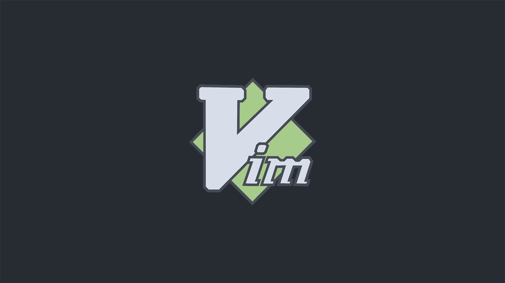

# BSPWM | Polybar themes collection with Theme Selector

## Puedes leer esta pagina en español [AQUI](INICIO.md)

## 🌿 Information
My version of gh0stzk's bspwm theme

## :book: Wiki
I already started writing the [**Wiki**](https://github.com/gh0stzk/dotfiles/wiki), you should give it a read. If it is your first time with a WM, you may be interested in reading [First steps after installing the dotfiles](https://github.com/gh0stzk/dotfiles/wiki/Firsts-steps-after-installing) or maybe read [frequently asked questions and answers](https://github.com/gh0stzk/dotfiles/wiki/Questions---Answers).

## Info


|Distro|[Arch](https://archlinux.org/)|
|:---:|:---:|
|WM|[BSPWM](https://github.com/baskerville/bspwm)|
|Bar|[Polybar](https://github.com/polybar/polybar)|
|Menu|[Rofi](https://github.com/davatorium/rofi)|
|Compositor|[Picom](https://archlinux.org/packages/community/x86_64/picom/)|
|Terminal|[Alacritty](https://github.com/alacritty/alacritty)|
|Widgets|[ElKowars wacky widgets ](https://github.com/elkowar/eww)|
|Music/Player|[mpd](https://archlinux.org/packages/extra/x86_64/mpd/)-[ncmpcpp](https://archlinux.org/packages/community/x86_64/ncmpcpp/)|
|File Manager|[Ranger](https://github.com/ranger/ranger)|
|Shell|[Zsh](https://archlinux.org/packages/extra/x86_64/zsh/)|
|Aur Helper|[Yay](https://github.com/Jguer/yay)|

<br>

## 🚀 Features
* **Random wallpaper:**  Every time you switch between rices or reload bspwm with <code>super + alt + r</code> a new wallpaper is set depending on the rice you are on.

* **Wallpaper Changer** <code>Super + Alt + w</code> changes bethween different wallpapers in the actual rice.

* **Hide / Unhide Bar:** If you needit you can hide bars

* **Change transparency on the fly:** 
Increase and decrease transparency in focused or selected window.

**And more..**

<table align="center">
   <tr>
      <th align="center">
         <sup><sub>:warning: WARNING :warning:</sub></sup>
      </th>
   </tr>
   <tr>
      <td align="center">
      
      
      
     THIS DOTFILES ARE CONFIGURED AT 1600x900 WITH 96 DPI! 1 MONITOR
     SOME STUFF MIGHT BREAK ON LOWER OR HIGHER
     RESOLUTIONS BUT WILL STILL WORK!
     
   </tr>
   </table>

## 🎨 The theme

|||
|---|---|

<details>
<summary><b>Extra wallpapers</b></summary>

||||
|:-:|:-:|:-:|
|||

</details>

## Neovim themes
Actually the neovim theme is OneDark, but the background will adapt to the colorscheme in the rice you are. Now is configured in "lua". i wanna keepit simple so there are a few plugins.
- Lualine
- Nvim-Tree
- Colorizer
- Devicons

The plugin manager is Packer.


## Firefox Theme (z0mbi3 Fox)

||
|:-:|
Complementarily you can install [this extension](https://github.com/PonyLucky/gh0stzk-Firefox/tree/master/extension) made by [PonyLucky](https://github.com/PonyLucky). It is a startpage to enhance UX. [Preview and configuration options](https://github.com/PonyLucky/gh0stzk-Firefox/tree/master/extension). Looks awesome with the firefox theme.

## Very useful keybindigs to know...

- <code>super + F1</code> Apps Menu.
- <code>super + h </code> Hides bar/s <code>super + u</code> unhide bar/s
- <code>super + Print</code> Takes screenshot.
- <code>ctrl + alt {plus,minus,t}</code> Changes transparency on focused window.
- <code>ctrl + super + alt + p</code> Power off computer. <code>ctrl + super + alt + r</code> Restart computer.
- <code>super + Return</code> Open a terminal.
- <code>super + Alt + Return</code> Open a floating terminal.
- <code>ctrl + super + alt + k</code> Brute Kill a window/process.
- <code>super + alt + w</code> Changes randomly wallpaper.
- <code>super + alt + r</code> Restart bspwm.

And more.. You need to look sxhkdrc file for more.

## 📦 setup

### 💾 Installation:
The installer only works for **ARCH** Linux, and based distros.

<b>Open a terminal in HOME</b>
- **First download the installer**
```sh
curl https://raw.githubusercontent.com/edwark43/dotfiles/master/RiceInstaller -o $HOME/RiceInstaller
```
- **Now give it execute permissions**
```sh
chmod +x RiceInstaller
```
- **Finally run the installer**
```sh
./RiceInstaller
```

## Troubleshooting & Tips

See the [Wiki](https://github.com/gh0stzk/dotfiles/wiki)


## Credits
- [turquoise-hexagon](https://github.com/turquoise-hexagon/fonts), [adi1090x](https://github.com/adi1090x/widgets), [gabrielzschmitz](https://github.com/gabrielzschmitz), [elenapan](https://github.com/elenapan/dotfiles), [rxyhn](https://github.com/rxyhn/bspdots), [okklol](https://github.com/okklol/eww-bar), [ikz87](https://github.com/ikz87), [Narmis-E](https://github.com/Narmis-E/onedark-wallpapers), [gh0stzk](https://github.com/gh0stzk/dotfiles).
